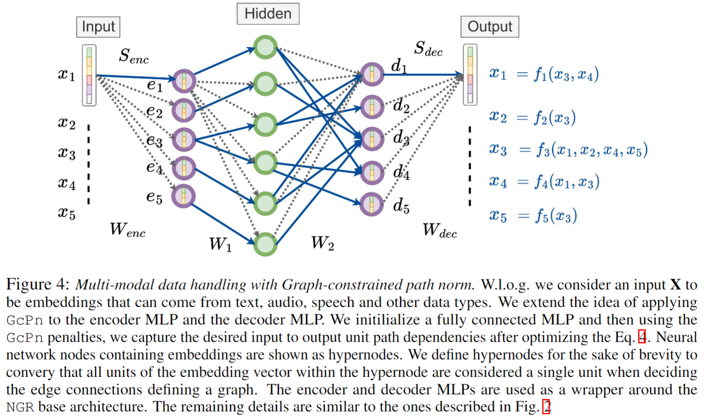

## Neural Graph Revealers
Neural Graph Revealers (NGRs) can model highly non-linear
and complex functional dependencies between the features by leveraging the expressive power of neural networks. It is a regression based approach that takes the D features as input and maps them to the same features as the output. In order to achieve sparsity without compromising on the function representation capacity, NGRs build up on the neat idea of viewing the neural networks as a ‘white box’. Specifically, the NNs can be considered as a multitask learning framework between
the input and output units. The paths between the input and output units are used to capture feature dependencies and thus restricting these paths (eg. using path-norms) can enforce desired sparsity in an unsupervised manner.  

Key benefits & features:  
- The functional dependencies are modeled using neural networks which are capable of representing rich & complex distributions.
- Fast and efficient algorithms for learning, inference and sampling.  
- Direct access to the learned underlying distributions for analysis. `NGR` is an instance of `Neural Graphical Models` 
- Handle different input data types like categorical, images & generic embedding representations.  
- Supports batch learning with GPU support.  
 

### High level overview  

  

       

## Setup  
The `setup.sh` file contains the complete procedure of creating a conda environment to run mGLAD model. run `bash setup.sh`    
In case of dependencies conflict, one can alternatively use this command `conda env create --name ngr --file=environment.yml`.  

## Demo on recovering Gausssian Graphical models (GGMs) using NGRs    
A minimalist working example of NGRs is given in `demo_NGR.ipynb`. It is a good entry point to understand the code structure as well as NGRs.  

## Citation  
If you find this method useful, kindly cite the following associated papers:  
- `Neural Graph Revealers`: [arxiv](<https://arxiv.org/abs/2302.13582>)  

- `Neural Graphical Models`: [arxiv](<https://arxiv.org/abs/2210.00453>)  

@article{shrivastava2022neural,  
  title={Neural Graphical Models},  
  author={Shrivastava, Harsh and Chajewska, Urszula},  
  journal={arXiv preprint arXiv:2210.00453},  
  year={2022}  
}  

- `uGLAD`: Sparse graph recovery by optimizing deep unrolled networks. [arxiv](<https://arxiv.org/abs/2205.11610>)  

@inproceedings{
shrivastava2022a,
title={A deep learning approach to recover conditional independence graphs},
author={Harsh Shrivastava and Urszula Chajewska and Robin Abraham and Xinshi Chen},
booktitle={NeurIPS 2022 Workshop: New Frontiers in Graph Learning},
year={2022},
url={https://openreview.net/forum?id=kEwzoI3Am4c}
}  

Talk: https://www.youtube.com/watch?v=Mx9VSQJACsA
